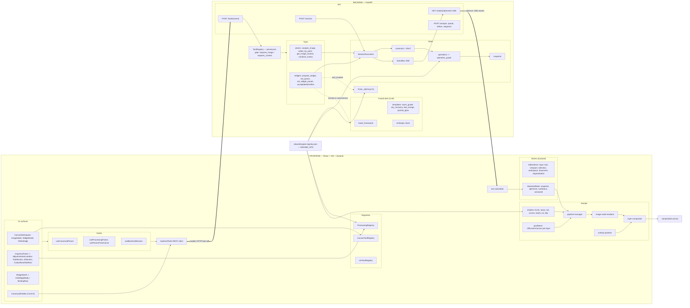
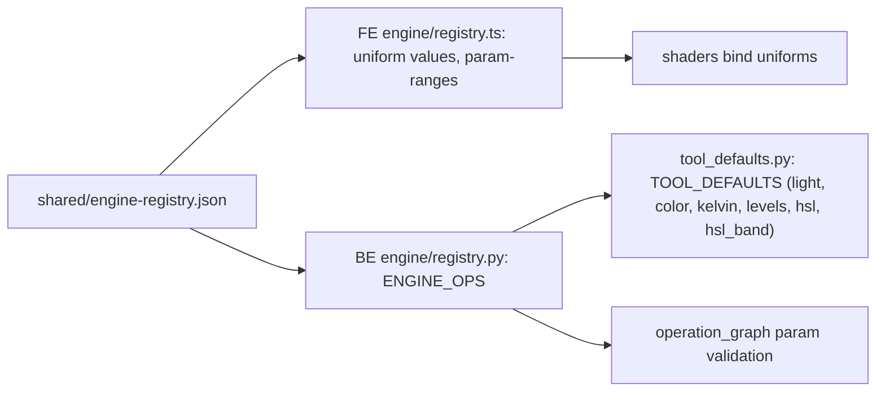
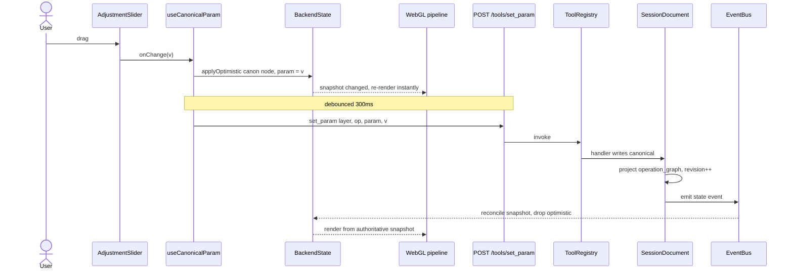
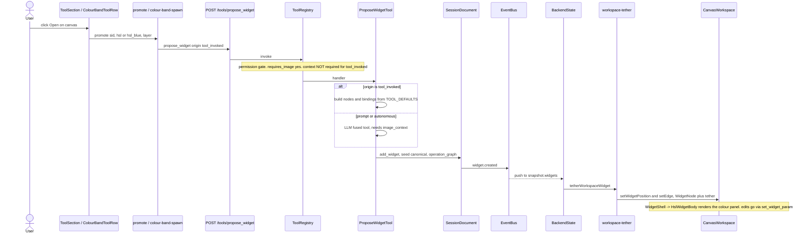
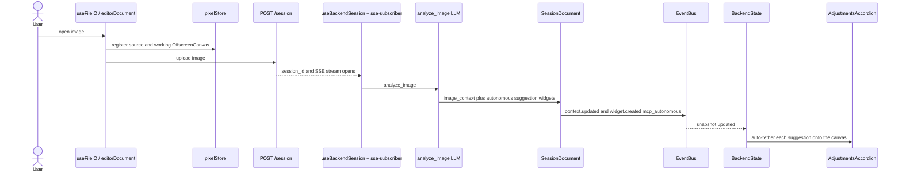
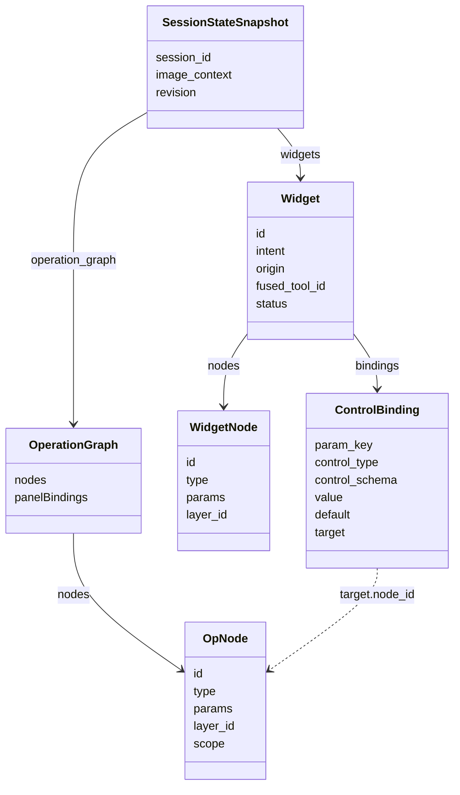

# Architecture — Detailed

Detailed companion to [`architecture-overview.md`](architecture-overview.md). Diagrams use
real module names. **One rule underpins all of it (Engine-SSoT):** the backend owns every
pixel-affecting value (`canonical`); the frontend mirrors that state and mutates it only
through tools.

> View rendered: GitLab renders Mermaid inline; in VS Code use the "Markdown Preview Mermaid
> Support" extension.

---

## 1 · Component & data-flow map



---

## 2 · The engine registry is shared truth



One JSON defines each op's params/ranges/scale/shaderBinding; both runtimes import it, so the
slider, the shader uniform, and the backend default never drift.

---

## 3 · Sequence — a manual adjustment (slider)



---

## 4 · Sequence — spawning a widget ("Open on canvas")



---

## 5 · Sequence — open image, analyze, autonomous suggestions



---

## 6 · Snapshot data model



Notes: `OpNode.id` = `canon:<layer>:<op>`. `Widget.origin` is one of `tool_invoked`,
`mcp_user_prompt`, `mcp_autonomous`. `Widget.status` is one of `active`, `dismissed`,
`accepted`. A binding's `target.node_id` points at the WidgetNode it drives; on
`add_widget` those params are seeded into `canonical`, which then projects the matching
`OpNode`.

---

## 7 · Module reference

### Frontend
| Area | Modules |
|---|---|
| Stores | `store/{layer,tool,viewport,selection,workspace,document,segmentation}-slice.ts`, `backend-state-slice.ts` |
| Param I/O | `hooks/useCanonicalParam.ts`, `lib/use-processing-param.ts`, `hooks/useParamProvenance.ts` |
| Session / SSE | `hooks/useBackendSession.ts`, `lib/sse-subscriber.ts`, `lib/backend-tools.ts` |
| Render | `lib/pipeline-manager.ts`, `image-node-renderer.ts`, `layer-compositor.ts`, `overlay-painters.ts`, `shaders/*`, `core/pixel-store.ts` |
| Canvas | `components/workspace/CanvasWorkspace.tsx`, `lib/workspace-tether.ts` |
| Registries | `lib/processing-registry.ts`, `canvas-tool-registry.ts`, `tool-manifest/llm-tool-registry.ts` |
| Spawn | `inspector/adjustments/promote.ts`, `lib/colour-band-spawn.ts`, `lib/toolrail-spawn.ts`, `lib/palette-actions.ts` |

### Backend
| Area | Modules |
|---|---|
| API | `api/{session,tools_rest,state,analyze,panel,refine,segment}.py` |
| Registry | `tools/registry.py`, `tools/base.py` (`ToolPermissions`) |
| Widget tools | `tools/widgets/{propose_widget,set_param,set_widget_param,accept,delete,refine,repeat,restore}.py` |
| Atomic tools | `tools/atomic/{analyze_image,select_by_point,select_by_box,get_image_context,combine_masks}.py` |
| Fused (LLM) | `tools/fused/*` (templates), `tools/fused_framework.py`, `tools/tool_defaults.py` |
| State | `state/{document,canonical,operations,snapshot,events,preview_renderer,context_stats}.py` |
| Shared | `shared/engine-registry.json`, `engine/registry.{ts,py}` |
```
