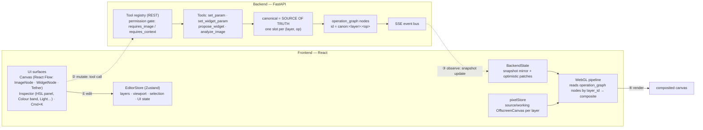
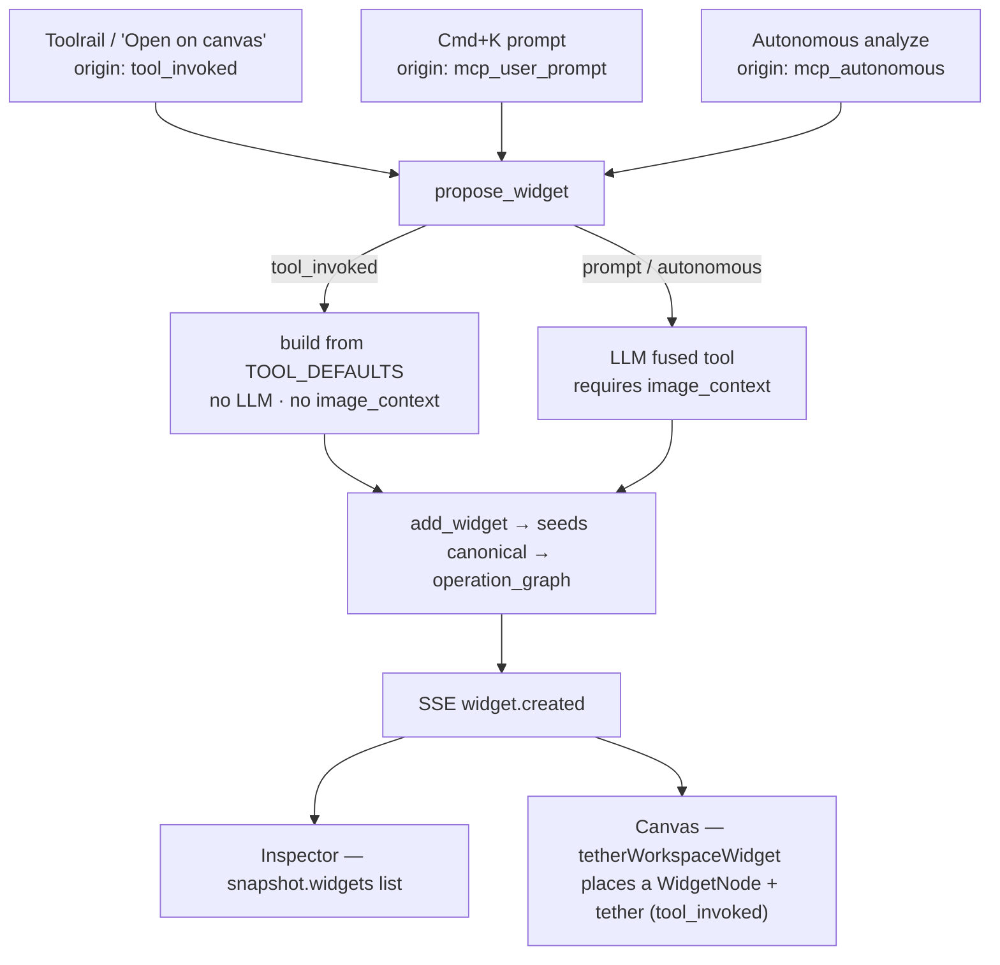

# Architecture Overview

The whole editor follows one rule — the **Engine-SSoT doctrine**:

> The **backend owns anything that touches pixels** (adjustment values, the operation
> graph, widgets, image context, masks). The **frontend reads that state and asks the
> backend to change it** via tools. The frontend owns only UI, layer metadata, and raw
> pixel bitmaps.

Everything below is a consequence of that rule.

---

## 1 · The core loop

**The cycle:** a slider / tool / Cmd+K edit calls a backend tool (`set_param`,
`propose_widget`, …). An **optimistic patch** moves pixels instantly while the call is in
flight. The backend mutates `canonical`, re-projects `operation_graph`, and emits an **SSE**
event; `BackendState` updates the snapshot and the WebGL pipeline re-renders. A value lives
in exactly one place — the slider is a *view* of it, moving it is a *request*. (That's why
tools need the backend connection: there's nothing local to write to.)

---

## 2 · How a widget is born — three paths, one call

All three spawn paths converge on `propose_widget`. The **HSL widgets** use this:
`fused_tool_id: 'hsl'` (all bands) and `'hsl_<band>'` (single band) on the `tool_invoked`
path. A widget renders in the inspector and — for `tool_invoked` — gets a tethered card on
the canvas.

> **Known fix (2026-06-01):** `propose_widget` used to require `image_context` for *every*
> origin, silently blocking the context-free `tool_invoked` "Open on canvas" before
> `analyze_image` ran. The fast path is now free of that requirement; the LLM path still
> requires context.

---

## 3 · Who owns what

| Owner | Responsibility |
|---|---|
| **Backend snapshot** | canonical adjustment values · `operation_graph` · widgets · `image_context` · masks |
| **Frontend `EditorStore`** | layer metadata · viewport · selection · UI-only state · optimistic patches |
| **Frontend `pixelStore`** | raw source/working bitmaps per layer (never in Zustand) |

---

## 4 · Code map

| Concept | Where |
|---|---|
| Snapshot mirror + SSE + optimistic | `src/store/backend-state-slice.ts` |
| Canonical param read/write (inspector) | `src/hooks/useCanonicalParam.ts` → `set_param` |
| Widget param write (canvas) | `src/components/widget/WidgetShell.tsx` → `set_widget_param` |
| WebGL render | `src/lib/pipeline-manager.ts`, `image-node-renderer.ts`, `layer-compositor.ts` |
| Canvas workspace | `src/components/workspace/CanvasWorkspace.tsx`, `src/lib/workspace-tether.ts` |
| Inspector tools list | `src/components/inspector/adjustments/AdjustmentsAccordion.tsx` |
| HSL panel (inspector + widget share `HslPanelView`) | `src/components/inspector/adjustments/`, `src/components/widget/HslWidgetBody.tsx` |
| Spawn (backend) | `backend/app/tools/widgets/propose_widget.py`, `tool_defaults.py` |
| Canonical → operation_graph | `backend/app/state/canonical.py`, `operations.py`, `document.py` |
| Tool permission gate | `backend/app/tools/registry.py`, `base.py` |
