# Architecture — hand-curated overview

> **Why this file exists.** `architecture-overview.svg` (auto-generated
> from `arkit.json` via `make diagram`) is exhaustive but visually
> overwhelming — every TypeScript file shows up as a node. This
> Mermaid figure is the *communicative* counterpart: ~30 hand-picked
> nodes that explain the architecture's main claim — pixel-affecting
> state has one canonical home on the backend (`SessionStateSnapshot`)
> and the frontend is a reactive mirror.
>
> The teal **toneSpine** picks out the three nodes that carry the
> Single Source of Truth: backend snapshot → SSE channel → frontend
> mirror. A reader's eye tracks the teal trail and sees the
> Engine-SSoT doctrine without having to read prose.
>
> Edit by hand when the architecture moves. Renders inline on GitHub
> + in any Mermaid-aware viewer. For a chapter figure, export via
> `mmdc -i architecture.md -o architecture.svg` (mermaid-cli) or
> paste into `https://mermaid.live` and download.

```mermaid
flowchart TD

subgraph group_desktop["Desktop shell"]
  node_electron_shell["Electron shell<br/>desktop bridge<br/>[main.cjs]"]
end

subgraph group_frontend["Frontend app"]
  node_app_shell["App shell<br/>React entry<br/>[App.tsx]"]

  subgraph group_ui["UI surfaces"]
    node_workspace_ui["Workspace<br/>React Flow canvas<br/>[CanvasWorkspace.tsx]"]
    node_inspector_ui["Inspector<br/>Adjustments / Info / Layer / Crop<br/>[InspectorPanel.tsx]"]
    node_toolbar_ui["Toolbar + MenuBar<br/>[MenuBar.tsx]"]
    node_palette_ui["Command palette<br/>Cmd+K<br/>[CommandPalette.tsx]"]
  end

  subgraph group_state["State (Zustand slices)"]
    node_editor_store[("EditorStore<br/>workspace / layers /<br/>selection / tool<br/>[index.ts]")]
    node_backend_state[("BackendState mirror<br/>snapshot + SSE status<br/>[backend-state-slice.ts]")]
    node_history["Frontend history<br/>linear undo stack<br/>[history.ts]"]
  end

  subgraph group_outside_state["Outside-state stores"]
    node_pixel_store[("PixelStore<br/>OffscreenCanvas per layer<br/>[pixel-store.ts]")]
    node_mask_store[("MaskStore<br/>alpha bytes per Object<br/>[mask-store.ts]")]
    node_pixel_source[("Pixel-source IDB<br/>session-keyed blobs<br/>[pixel-source-store.ts]")]
  end

  node_document_model["Document facade<br/>open / undo / persist<br/>[document.ts]"]

  subgraph group_render["Render pipeline"]
    node_render_orchestrator["useImageNodeRender<br/>per-image canvas hook<br/>[useImageNodeRender.ts]"]
    node_image_renderer["Image-node renderer<br/>per-layer + composite-then-apply<br/>[image-node-renderer.ts]"]
    node_layer_compositor["LayerCompositor<br/>WebGL per-layer pipeline<br/>[layer-compositor.ts]"]
    node_shaders["Shader sources<br/>[pipeline.ts]"]
  end

  node_workers["Workers<br/>Photon WASM via Comlink<br/>[processing.worker.ts]"]

  subgraph group_registries["Registries"]
    node_processing_registry["ProcessingRegistry<br/>inspector schema<br/>[processing-registry.ts]"]
    node_canvas_tool_registry["CanvasToolRegistry<br/>left-rail tools<br/>[canvas-tool-registry.ts]"]
    node_llm_tool_registry["LlmToolRegistry<br/>agent tool manifests<br/>[llm-tool-registry.ts]"]
  end

  node_segmentation["Segmentation<br/>MobileSAM client<br/>[mobile-sam-client.ts]"]
  node_ai_session["useAiSession<br/>session lifecycle<br/>[useImageContext.ts]"]
end

subgraph group_backend["Backend service (FastAPI :8787)"]
  node_backend_api["REST API<br/>tool + state routes<br/>[main.py]"]
  node_backend_snapshot[("SessionStateSnapshot<br/>SSoT for pixels<br/>[document.py]")]
  node_backend_tools["Backend tools<br/>set_param / propose_stack /<br/>accept_widget / propose_mask<br/>[tools/]"]
  node_backend_session[("Session store<br/>per-session lock + persist<br/>[session_store.py]")]
  node_backend_history["HistoryEngine<br/>before/after snapshots<br/>[history.py]"]
  node_backend_sse(["SSE channel<br/>/api/state/{sid}/events"])
  node_backend_registry["Registry loader<br/>ops + presets<br/>[loader.py]"]
  node_anthropic["Anthropic client<br/>tool-use agent loop<br/>[anthropic_client.py]"]
  node_admin_cockpit["Admin cockpit<br/>/admin (loopback-gated)<br/>[admin.py]"]
  node_telemetry[("Event journal<br/>append-only JSONL<br/>[event_journal.py]")]
end

subgraph group_shared["Shared contracts"]
  node_shared_registry["Registry data<br/>JSON ops + presets<br/>[shared/registry/ops/]"]
  node_shared_schemas["Generated wire types<br/>[shared/types/generated.ts]"]
end

%% --- Desktop -------------------------------------------------------
node_electron_shell -->|"hosts both"| node_app_shell
node_electron_shell -->|"spawns"| node_backend_api

%% --- UI -> state ---------------------------------------------------
node_app_shell --> node_workspace_ui
node_app_shell --> node_inspector_ui
node_app_shell --> node_toolbar_ui
node_app_shell --> node_palette_ui
node_workspace_ui -->|"reads"| node_editor_store
node_inspector_ui -->|"reads"| node_editor_store
node_inspector_ui -->|"reads"| node_backend_state
node_toolbar_ui -->|"dispatches"| node_document_model
node_palette_ui -->|"dispatches"| node_backend_tools

%% --- Document + history ---------------------------------------------
node_document_model -->|"mutates"| node_editor_store
node_document_model -->|"pushes"| node_history
node_document_model -->|"persists"| node_pixel_source

%% --- Render pipeline -----------------------------------------------
node_workspace_ui -->|"mounts"| node_render_orchestrator
node_render_orchestrator -->|"reads snapshot"| node_backend_state
node_render_orchestrator -->|"reads"| node_editor_store
node_render_orchestrator -->|"reads pixels"| node_pixel_store
node_render_orchestrator -->|"calls"| node_image_renderer
node_image_renderer -->|"per-layer"| node_layer_compositor
node_layer_compositor -->|"compiles"| node_shaders
node_layer_compositor -->|"offloads"| node_workers
node_inspector_ui -->|"binds via"| node_processing_registry

%% --- Segmentation --------------------------------------------------
node_segmentation -->|"writes alpha"| node_mask_store
node_mask_store -->|"consumed by"| node_image_renderer

%% --- Frontend -> Backend tool calls --------------------------------
node_inspector_ui -->|"slider commit"| node_backend_tools
node_workspace_ui -->|"object actions"| node_backend_tools
node_ai_session -->|"propose_stack /<br/>propose_mask"| node_backend_tools

%% --- Backend SSoT spine --------------------------------------------
node_backend_api --> node_backend_tools
node_backend_api --> node_backend_session
node_backend_tools -->|"mutate"| node_backend_snapshot
node_backend_tools -->|"push entry"| node_backend_history
node_backend_snapshot -->|"emit state.* /<br/>widget.* / history.*"| node_backend_sse
node_backend_session -->|"owns"| node_backend_snapshot
node_backend_session -->|"owns"| node_backend_history

%% --- SSE -> frontend mirror ----------------------------------------
node_backend_sse -->|"streams"| node_backend_state

%% --- Agent + registry loaders --------------------------------------
node_backend_tools -->|"calls"| node_anthropic
node_anthropic -.->|"invokes"| node_llm_tool_registry
node_backend_tools -->|"resolves ops"| node_backend_registry
node_backend_registry -->|"loads"| node_shared_registry
node_processing_registry -->|"reads"| node_shared_registry

%% --- Shared contracts ----------------------------------------------
node_backend_api -.->|"emits"| node_shared_schemas
node_backend_state -.->|"reads typed"| node_shared_schemas
node_editor_store -.->|"reads typed"| node_shared_schemas

%% --- Cockpit + telemetry -------------------------------------------
node_backend_tools -->|"appends"| node_telemetry
node_admin_cockpit -->|"reads"| node_telemetry
node_admin_cockpit -->|"reads"| node_backend_session

click node_app_shell "https://github.com/sirantonysir/editor/blob/main/src/App.tsx"
click node_workspace_ui "https://github.com/sirantonysir/editor/blob/main/src/components/workspace/CanvasWorkspace.tsx"
click node_inspector_ui "https://github.com/sirantonysir/editor/blob/main/src/components/inspector/InspectorPanel.tsx"
click node_toolbar_ui "https://github.com/sirantonysir/editor/blob/main/src/components/toolbar/MenuBar.tsx"
click node_palette_ui "https://github.com/sirantonysir/editor/blob/main/src/components/CommandPalette.tsx"
click node_editor_store "https://github.com/sirantonysir/editor/blob/main/src/store/index.ts"
click node_backend_state "https://github.com/sirantonysir/editor/blob/main/src/store/backend-state-slice.ts"
click node_history "https://github.com/sirantonysir/editor/blob/main/src/core/history.ts"
click node_pixel_store "https://github.com/sirantonysir/editor/blob/main/src/core/pixel-store.ts"
click node_mask_store "https://github.com/sirantonysir/editor/blob/main/src/core/mask-store.ts"
click node_pixel_source "https://github.com/sirantonysir/editor/blob/main/src/core/pixel-source-store.ts"
click node_document_model "https://github.com/sirantonysir/editor/blob/main/src/core/document.ts"
click node_render_orchestrator "https://github.com/sirantonysir/editor/blob/main/src/hooks/useImageNodeRender.ts"
click node_image_renderer "https://github.com/sirantonysir/editor/blob/main/src/lib/image-node-renderer.ts"
click node_layer_compositor "https://github.com/sirantonysir/editor/blob/main/src/lib/layer-compositor.ts"
click node_shaders "https://github.com/sirantonysir/editor/blob/main/src/shaders/pipeline.ts"
click node_workers "https://github.com/sirantonysir/editor/blob/main/src/workers/processing.worker.ts"
click node_processing_registry "https://github.com/sirantonysir/editor/blob/main/src/lib/processing-registry.ts"
click node_canvas_tool_registry "https://github.com/sirantonysir/editor/blob/main/src/lib/canvas-tool-registry.ts"
click node_llm_tool_registry "https://github.com/sirantonysir/editor/blob/main/src/lib/tool-manifest/llm-tool-registry.ts"
click node_segmentation "https://github.com/sirantonysir/editor/blob/main/src/lib/segmentation/mobile-sam-client.ts"
click node_ai_session "https://github.com/sirantonysir/editor/blob/main/src/hooks/useImageContext.ts"
click node_backend_api "https://github.com/sirantonysir/editor/blob/main/backend/app/main.py"
click node_backend_snapshot "https://github.com/sirantonysir/editor/blob/main/backend/app/state/document.py"
click node_backend_tools "https://github.com/sirantonysir/editor/blob/main/backend/app/tools/"
click node_backend_session "https://github.com/sirantonysir/editor/blob/main/backend/app/services/session_store.py"
click node_backend_history "https://github.com/sirantonysir/editor/blob/main/backend/app/session/history.py"
click node_backend_sse "https://github.com/sirantonysir/editor/blob/main/backend/app/api/state.py"
click node_backend_registry "https://github.com/sirantonysir/editor/blob/main/backend/app/registry/loader.py"
click node_anthropic "https://github.com/sirantonysir/editor/blob/main/backend/app/services/anthropic_client.py"
click node_admin_cockpit "https://github.com/sirantonysir/editor/blob/main/backend/app/api/admin.py"
click node_telemetry "https://github.com/sirantonysir/editor/blob/main/backend/app/services/event_journal.py"
click node_shared_registry "https://github.com/sirantonysir/editor/blob/main/shared/registry/ops"
click node_shared_schemas "https://github.com/sirantonysir/editor/blob/main/shared/types/generated.ts"
click node_electron_shell "https://github.com/sirantonysir/editor/blob/main/electron/main.cjs"

classDef toneFrontend fill:#dbeafe,stroke:#2563eb,stroke-width:1.5px,color:#172554
classDef toneBackend fill:#fef3c7,stroke:#d97706,stroke-width:1.5px,color:#78350f
classDef toneShared fill:#dcfce7,stroke:#16a34a,stroke-width:1.5px,color:#14532d
classDef toneDesktop fill:#ffe4e6,stroke:#e11d48,stroke-width:1.5px,color:#881337
classDef toneSpine fill:#ccfbf1,stroke:#0f766e,stroke-width:2px,color:#134e4a

class node_app_shell,node_workspace_ui,node_inspector_ui,node_toolbar_ui,node_palette_ui,node_editor_store,node_history,node_document_model,node_render_orchestrator,node_image_renderer,node_layer_compositor,node_shaders,node_workers,node_processing_registry,node_canvas_tool_registry,node_llm_tool_registry,node_segmentation,node_ai_session toneFrontend
class node_pixel_store,node_mask_store,node_pixel_source toneFrontend
class node_backend_api,node_backend_tools,node_backend_session,node_backend_history,node_backend_registry,node_anthropic,node_admin_cockpit,node_telemetry toneBackend
class node_shared_registry,node_shared_schemas toneShared
class node_electron_shell toneDesktop
class node_backend_snapshot,node_backend_sse,node_backend_state toneSpine
```

